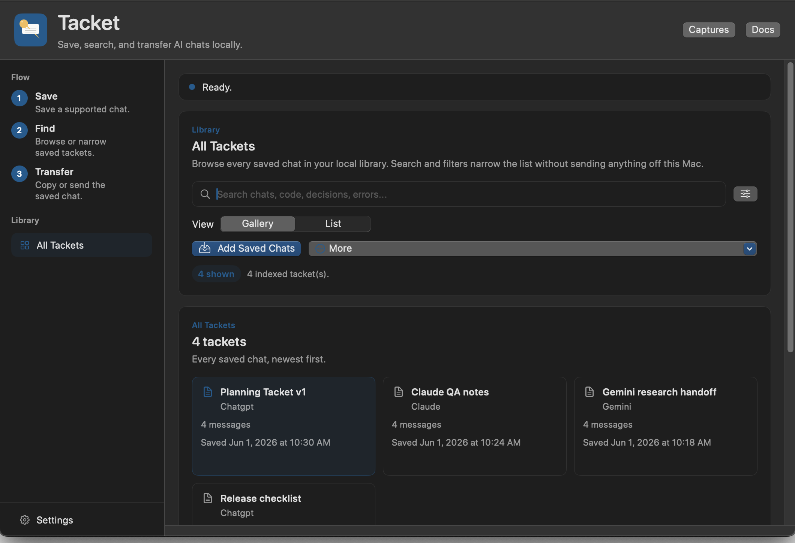
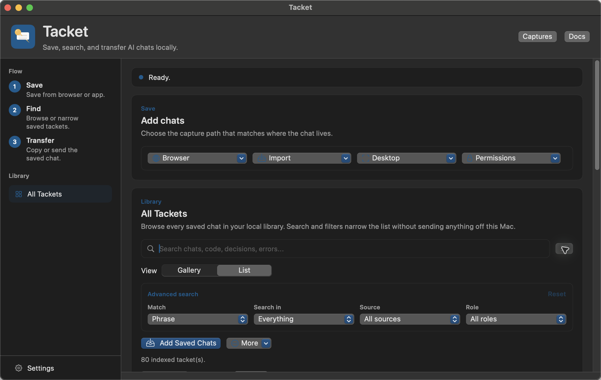

# Tacket

Tacket is a private library for saving and searching your AI chats on your Mac.

Use the Chrome extension on ChatGPT, Claude, or Gemini in the browser to save full raw chat transcripts. Use the Mac app to import exact local transcripts from Codex App, Claude App, and Claude Code, or to preview and save a local capture of the current open ChatGPT, Claude, or Codex desktop app chat. Tacket stores saved chats on your Mac, makes them searchable, and lets you copy or send saved conversations to Codex, Claude Code, or your clipboard when you need the context again.

Tacket will always be free and open source. It has no accounts, no analytics, no telemetry, and no backend that can see your chats.

Tacket has two local pieces: a Chrome extension for exact browser chat transcripts and a Mac app for storing, searching, exact local transcript import, desktop app capture previews, and transfer. Browser saves go directly from the extension to the Tacket app on your Mac. Exact imports read local Codex App, Claude App, and Claude Code session data only after you click import. Desktop app capture scrolls the current app window, uses local macOS Accessibility or on-device OCR to read visible chat text, and shows a preview before saving. Saved chat text is not sent to me or to a Tacket server.

## Screenshots

Browse every saved chat in the local Mac app library.



Use search and filters to narrow saved transcripts without sending anything off your Mac.



## What It Does

- Saves browser conversations only after you click the extension.
- Imports recent local Codex App, Claude App, and Claude Code transcripts only after you click import.
- Previews and saves local captures of the current open ChatGPT, Claude, and Codex desktop app chat from the Mac app.
- Keeps saved chats as readable files on your Mac.
- Lets you browse all saved chats in one place.
- Searches saved chats, code snippets, decisions, and errors without sending them anywhere.
- Copies or sends the full saved conversation to Clipboard, Codex, or Claude Code.
- Uses no backend, no analytics, no telemetry, and no model/API calls.

Tacket is not an agent harness. It does not run agents for you or scan app session stores in the background.

## Install

Public releases will be the shortest path:

1. Download `Tacket.dmg` from the [latest release](https://github.com/maddiedreese/tacket/releases).
2. Open the DMG and drag Tacket into Applications.
3. Add the Tacket Chrome extension.
4. Open Tacket once so the app and extension can talk to each other locally.

You can also build it from source:

```bash
npm install
npm run package:release
open dist/Tacket.app
```

Then load `apps/chrome-extension` as an unpacked Chrome extension and connect it to the local app:

```bash
node apps/cli/bin/tacket.js install-native-host --extension-id <chrome-extension-id>
```

## Use

1. Open a ChatGPT, Claude, or Gemini conversation in Chrome and click the Tacket extension; import recent Codex App, Claude App, or Claude Code transcripts from the Mac app; or open a ChatGPT, Claude, or Codex desktop app chat and click its preview button in Tacket.
2. Choose **Save Conversation** in the extension, **Import Codex App** / **Import Claude App** / **Import Claude Code** in the Mac app, or review and save the local desktop capture preview.
3. Open Tacket and choose **Add Saved Chats** in Library if the saved chat is not already indexed.
4. Search, filter, or select the saved chat.
5. Transfer it to Clipboard, Codex, or Claude Code.

Desktop app capture may trigger macOS Accessibility or Screen Recording permission prompts. Tacket uses those permissions to scroll and read the open desktop app window locally, then shows a preview with quality signals before saving. The first automated transfer may also trigger an Automation prompt so Tacket can open Terminal and paste the saved conversation after you choose a transfer target.

Exact local transcript import does not need Accessibility or Screen Recording. It reads recent Codex App, Claude App, and Claude Code session data from your Mac when you click import, converts new sessions into `.tacket` folders, checks the local library index to skip sessions that are already saved, and indexes everything locally.

## Saved Files

Each saved chat is stored as a local folder. The folder includes a readable transcript, structured message data, and any attachments Tacket was able to save:

```text
2026-06-01 10.51 - ChatGPT - Planning the app.tacket/
  README.md
  manifest.json
  messages.jsonl
  transcript.md
  attachments/
  targets/
    codex.md
    claude-code.md
```

You can inspect these files yourself. The folder name includes the date you saved the chat, the source app, and the chat title. If Tacket saves the same chat name twice, it adds a Finder-style suffix like `(2)`.

## Local Library

Tacket builds a local search index from the chats you choose to add to the Library. The index stays on your Mac. It does not summarize conversations, generate embeddings, call a model, sync to a server, or send indexed text anywhere.

Advanced search can match an exact phrase, all terms, or any term; search conversation text or titles; and filter by source or message role.

## Privacy

Tacket is designed to stay on your Mac. See [docs/PRIVACY.md](docs/PRIVACY.md) and the public [privacy page](website/privacy.html) for the current privacy contract.

## Support

Tacket is made by [@maddiedreese](https://github.com/maddiedreese). If you want to support the project, you can sponsor development on [GitHub Sponsors](https://github.com/sponsors/maddiedreese).

## Contributing

Issues and pull requests are welcome. Before opening a PR, run:

```bash
npm run verify
```

Release planning lives in [docs/ROADMAP.md](docs/ROADMAP.md). Troubleshooting lives in [docs/TROUBLESHOOTING.md](docs/TROUBLESHOOTING.md).

## License

Apache-2.0
